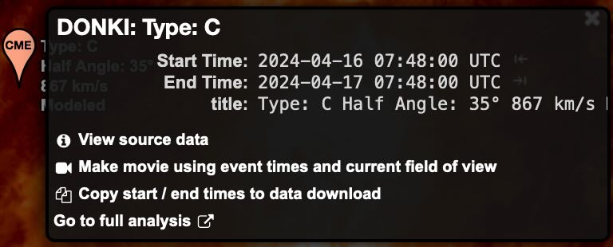
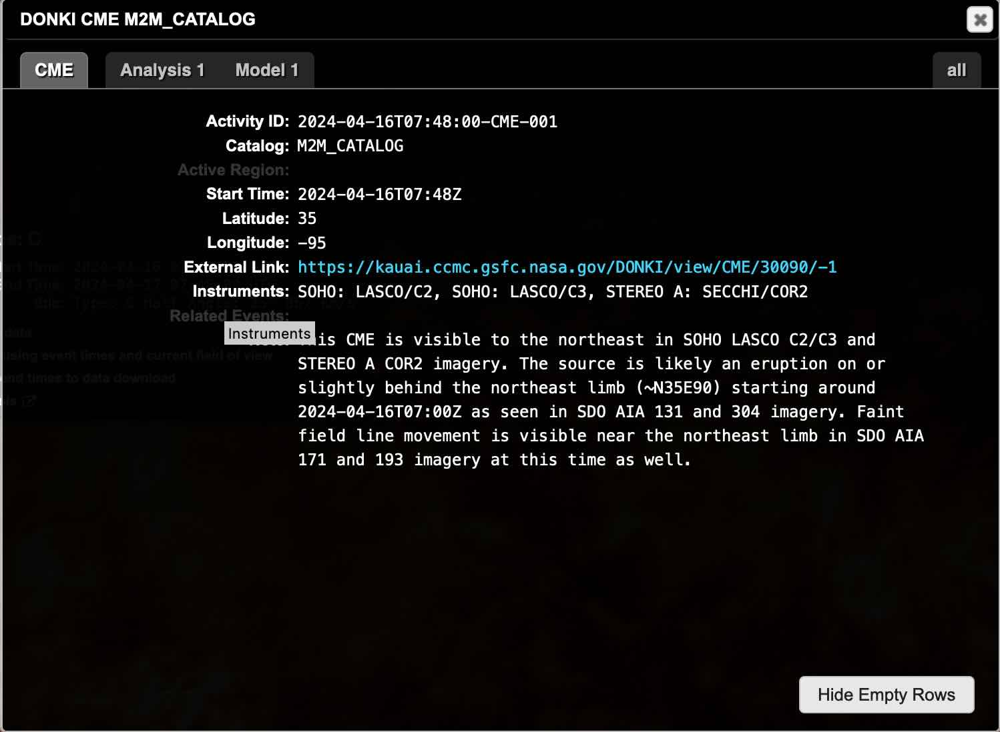

# Documentation

In this documentation, I describe the design of this system so developers that
plan to contribute to this interface have an understanding of how the system
works.

## Goals

The goal for this project is to define a standard framework for display feature
information on [Helioviewer.org](https://helioviewer.org). This event information
looks like this:

And then when the user selects **View source data** They see this:

All of the content in both screenshots above are generated from from an object
returned by this event interface. Using this interface as an intermediary between
event sources and Helioviewer allows us to parse the event sources into a known
format and make them available on Helioviewer using a data driven renderer.

Historical Note

Helioviewer's original implementation of features and events focused exclusively
on [HEK Events](https://www.lmsal.com/hek/). At the time of writing, this event
interface is not included in Helioviewer's event timeline, since that is still
tightly coupled with the HEK implementation. Enabling this interface allowed us
to include data from [CCMC DONKI's APIs](https://ccmc.gsfc.nasa.gov/tools/DONKI/)
and [CCMC's Flare Scoreboard](https://ccmc.gsfc.nasa.gov/scoreboards/flare/).

## Architecture

All data returned by the Helioviewer Event Interface should conform to the
[Helioviewer Event Format](https://api.helioviewer.org/docs/v2/appendix/helioviewer_event_format.html).

This interface is meant to make it easy to add new sources, but it still takes
custom code to format the output from an API into the Helioviewer Event Format.

The core of the event interface handles these 3 things:
- Querying data from an event API
- Caching results from an event API to reduce load
- Provides utilities for parsing API data

The extensible portion of the interface handles processing API data into the event format.

## Querying Data

Event data must be read from an HTTP API. These days this is a common way to
access data, whether it's using TAP, HAPI, or a custom API output, HTTP is the
standard for getting information from servers. This interface handles querying
all the requested data sources simultaneously.

## Caching Data

Helioviewer.org is a public website with many active users making many requests
simultaneously. It would cause a heavy load on our data providers if we were
constantly making requests for the same data for each user. So the event interface
internally caches event data based on the query parameters.
